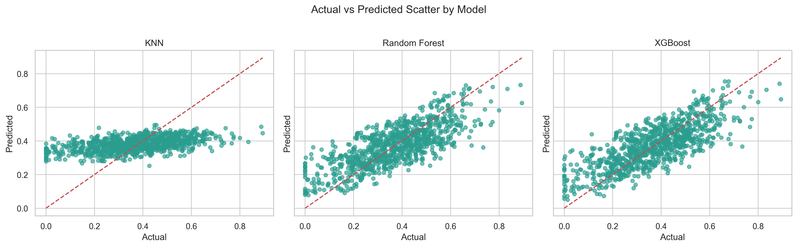

# Machine Learning Assignment

## Project Overview

This project applies three regression models to predict `Electricity_Consumed` from a smart meter dataset:

- `K-Nearest Neighbors (KNN)`
- `Random Forest`
- `XGBoost`

The study is framed as a regression task because the target variable is a continuous energy-consumption value. Model performance is evaluated using `R2 Score`, `MAE`, `MSE`, and `RMSE`.

## Dataset Description

Dataset file:

- `smart_meter_data.csv`

Main variables:

- `Timestamp`: date and time of each smart meter reading
- `Electricity_Consumed`: target variable
- `Temperature`: normalized temperature reading
- `Humidity`: normalized humidity reading
- `Wind_Speed`: normalized wind speed reading
- `Avg_Past_Consumption`: historical average electricity consumption
- `Anomaly_Label`: anomaly tag from the original dataset

Sample records:

| Timestamp | Electricity_Consumed | Temperature | Humidity | Wind_Speed | Avg_Past_Consumption | Anomaly_Label |
|---|---:|---:|---:|---:|---:|---|
| 2024-01-01 00:00:00 | 0.457786 | 0.469524 | 0.396368 | 0.445441 | 0.692057 | Normal |
| 2024-01-01 00:30:00 | 0.351956 | 0.465545 | 0.451184 | 0.458729 | 0.539874 | Normal |
| 2024-01-01 01:00:00 | 0.482948 | 0.285415 | 0.408289 | 0.470360 | 0.614724 | Normal |
| 2024-01-01 01:30:00 | 0.628838 | 0.482095 | 0.512308 | 0.576241 | 0.757044 | Normal |
| 2024-01-01 02:00:00 | 0.335974 | 0.624741 | 0.672021 | 0.373004 | 0.673981 | Normal |

## Data Preparation

The data preparation process includes:

- converting `Timestamp` to datetime format
- sorting records chronologically
- generating time-based and historical features
- removing rows with missing values created by lag and rolling operations
- splitting the dataset chronologically into training and testing sets

To avoid target leakage, only past information is used when constructing lag and rolling features.

## Selected Features

The final regression models use the following predictors:

- `Past_Ratio_1`
- `Past_Diff_1`
- `RollingMean_6`
- `RollingMax_12`
- `RollingStd_12`
- `Past_RollingMean_12`
- `Avg_Past_Consumption`
- `RollingMin_12`
- `RollingMin_6`
- `EWM_12`

These variables summarize short-term history and recent consumption behavior, which are the most informative signals for the target.

## Models Used

The following regression models are compared:

1. `KNeighborsRegressor`
2. `RandomForestRegressor`
3. `XGBRegressor`

The script uses fixed training settings based on earlier parameter selection and trains all three models on the same chronological split.

## Evaluation Metrics

The models are evaluated using:

- `R2 Score`
- `MAE`
- `MSE`
- `RMSE`

## Final Results

| Model | R2 Score | MAE | MSE | RMSE |
|---|---:|---:|---:|---:|
| XGBoost | 0.594886 | 0.081731 | 0.010660 | 0.103246 |
| Random Forest | 0.581963 | 0.082663 | 0.011000 | 0.104879 |
| KNN | 0.515218 | 0.090458 | 0.012756 | 0.112942 |

## Discussion

Among the three machine learning models, `XGBoost` records the highest `R2 Score`, with `Random Forest` producing a very similar result. `KNN` also performs reasonably in the final feature space, although it remains below the tree-based approaches.

The results indicate that recent historical consumption patterns are more informative than broad weather or calendar features alone. Short-term rolling statistics and recent historical ratios provide useful information for estimating the next electricity-consumption value.

## Output Files

Each run of the script writes:

- `model_outputs/model_comparison.csv`
- `model_outputs/actual_predicted_scatter.png`

The output directory is cleaned at the start of each run so only the latest result files remain.

## Visual Output



## Running The Project

Install dependencies:

```powershell
python -m pip install pandas scikit-learn xgboost matplotlib seaborn
```

Run the project:

```powershell
python mlass.py
```

## Repository Notes

- the project keeps the source code, dataset, and latest result files in the repository
- the assignment PDF is ignored and not tracked in Git
- the project is organized for sharing and collaboration through GitHub
